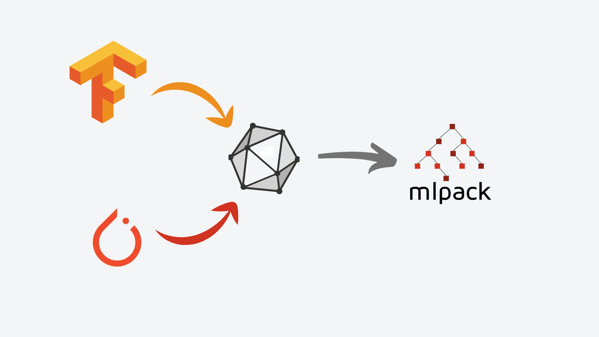

# mlpack-TensorFlow Translator

  <h1>

## Dependencies

- **Primary Dependencies : boost, armadillo, ensmallen, mlpack**
- C++11 is the minimum version required for cpp.

<h2 align="center">
  
   a fast, header-only machine learning library 
</h2>
